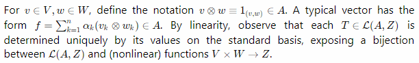
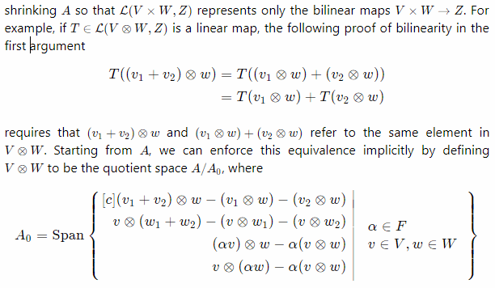
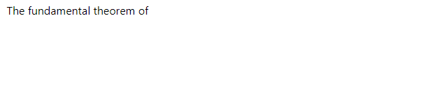

# `prosemirror-math`

[](https://www.npmjs.com/package/@benrbray/prosemirror-math)


> **Note:** This project is still in development, and there may be breaking changes with each release before a `>=1.0.0` version is ready.  Please don't hesitate to report issues or make feature requests!  Contributions welcome!

## Overview

The `prosemirror-math` package provides schema and plugins for comfortably writing mathematics with [ProseMirror](https://prosemirror.net/).  Written in TypeScript, with math rendering handled by [KaTeX](https://katex.org/).  You can install the [npm package](https://www.npmjs.com/package/@benrbray/prosemirror-math) or use this repository as a starting point for your own plugin.  The important files in this project are:

* `src/math-schema.ts`: A minimal ProseMirror schema supporting inline and display math nodes.
* `src/math-nodeview.ts`: A `NodeView` responsible for rendering and editing math nodes.
* `style/math.css`: Contains all necessary styling for math nodes to display correctly.  This file can easily be modified to achieve your desired appearance.

Additionally, the `docs-src/` contains Aafully-functioning example project that uses webpack generate a static website that includes `prosemirror-math` and all its dependencies.  

* If you want to the example code as a starting point for your own project, pay special attention to the comments in `docs-src/webpack.config.js`.

## Basic Usage  ([try it yourself!](http://benrbray.com/prosemirror-math/))

Unlike other editors, this plugin **treats math as part of the text itself**, rather than as an "atom" that can only be edited through a dialog box.  For example, inline math nodes can be edited directly by bringing the cursor inside of them:



Display math supports multiline editing, as shown below:



To create a new math expression, simply enclose LaTeX math notation in dollar signs, like `$x+y=5$`.  When you finish typing, a new math node will be automatically created:


To start a display math block, create a blank line and type `$$` followed by a space.  A multiline editor will appear.  To exit the block, press `Ctrl-Enter` or navigate away the mouse or arrow keys.



Math nodes behave like regular text when using the arrow keys or `Backspace`.  You can select, copy, and paste math nodes just like regular text!  From within a math node, press `Ctrl-Backspace` to delete the entire node.

> **TIP:** You can define your own commands with `\providecommand{\cmd}{...}`!

See the KaTeX documentation for a list of [supported LaTeX commands](https://katex.org/docs/supported.html). In the future, `prosemirror-math` will also accept a custom callback that can be used to invoke alternative renderers like MathJax.

## Installation & Setup

Note that `prosemirror-math` is built on top of [ProseMirror](https://prosemirror.net/), which itself has a steep learning curve.  At the very least, you will need to understand [`Schema`](https://prosemirror.net/docs/ref/#model.Document_Schema) and [`Plugins`](https://prosemirror.net/docs/ref/#state.Plugin_System) to integrate `prosemirror-math` into your project.  Start by installing the npm package:

```
npm install @benrbray/prosemirror-math
```

### CSS

First, make sure you include the CSS files for `prosemirror-math` and `katex` on any pages that will need them.  They can be found at the following paths:

```
node_modules/katex/dist/katex.min.css
node_modules/@benrbray/prosemirror-math/style/math.css
```

If you are using webpack with the `HtmlWebpackPlugin` and `MiniCssExtractPlugin`, you might need to include the CSS files like this:

```
import "@benrbray/prosemirror-math/style/math.css";
import "katex/dist/katex.min.css";
```

### Schema

Add `math_inline` and `math_display` nodes to your document schema.  The names are important!  If you modify the schema, be careful not to change any of the values marked `important!` below, or you might run into unexpected behavior!

```typescript
import { Schema } from "prosemirror-model";

let schema = new Schema({
    nodes: {
        doc: {
            content: "block+"
        },
        paragraph: {
            content: "inline*",
            group: "block",
            parseDOM: [{ tag: "p" }],
            toDOM() { return ["p", 0]; }
        },
        math_inline: {               // important!
            group: "inline math",
            content: "text*",        // important!
            inline: true,            // important!
            atom: true,              // important!
            toDOM: () => ["math-inline", { class: "math-node" }, 0],
            parseDOM: [{
                tag: "math-inline"   // important!
            }]
        },
        math_display: {              // important!
            group: "block math",
            content: "text*",        // important!
            atom: true,              // important!
            code: true,              // important!
            toDOM: () => ["math-display", { class: "math-node" }, 0],
            parseDOM: [{
                tag: "math-display"  // important!
            }]
        },
        text: {
            group: "inline"
        }
    }
});
```

### Input Rules

If you want the user to be able to easily add new math nodes by typing `$...$` for inline math or `$$` followed by a space for block math, you need to create [`InputRule`](https://prosemirror.net/docs/ref/#inputrules.InputRule) instances.  You can write your own, or use the helper functions provided by `prosemirror-math`.

> **CAUTION:**  Make sure the `NodeType`s you provide to each input rule belong to the same schema instance that you pass to your ProseMirror `EditorView` instance.  Otherwise, you'll see strange errors in the console!

```typescript
import {
	makeBlockMathInputRule, makeInlineMathInputRule,
	REGEX_INLINE_MATH_DOLLARS, REGEX_BLOCK_MATH_DOLLARS
} from "@benrbray/prosemirror-math";

// create input rules (using default regex)
let inlineMathInputRule = makeInlineMathInputRule(REGEX_INLINE_MATH_DOLLARS, editorSchema.nodes.math_inline);
let blockMathInputRule = makeBlockMathInputRule(REGEX_BLOCK_MATH_DOLLARS, editorSchema.nodes.math_display);
```

### Plugins

Choose which plugins you need from the following list, and pass them to your `EditorState` instance, along with the input rules you created.

* `mathPlugin` **(required)** Provides the core functionality of `prosemirror-math`.
* `mathBackspaceCmd` *(recommended)* When included in your [keymap](https://prosemirror.net/docs/ref/#keymap.keymap) for the `"Backspace"` key, pressing backspace on the right boundary of a math node will place the cursor inside the math node, rather than deleting it.
* `insertMathCmd(nodeType: NodeType)` *(optional)* Helper function for creating a command which can be used to insert a math node at the current document position.
* `mathSerializer` *(recommended)* Attach to the `clipboardTextSerializer` prop of your EditorView.  When pasting a selection from a `prosemirror-math` editor to a plain text editor, ensures that the pasted math expressions will be properly delimited by `$...$` and `$$...$$`.
* `mathSelectPlugin` *(in progress)* You'll notice that by default, selecting math nodes will place ugly selection boxes around each individual character in a rendered math expression.  This plugin attempts to improve the default appearance of text selections for text that contains math nodes.

Here is the recommended setup:

```typescript
import { mathPlugin, mathBackspaceCmd, insertMathCmd, mathSerializer } from "@benrbray/prosemirror-math";

// prosemirror imports
import { EditorView } from "prosemirror-view";
import { EditorState, Plugin } from "prosemirror-state";
import { chainCommands, deleteSelection, selectNodeBackward, joinBackward, Command } from "prosemirror-commands";
import { keymap } from "prosemirror-keymap";
import { inputRules } from "prosemirror-inputrules";

// plugins (order matters)
let plugins:Plugin[] = [
    mathPlugin,
    keymap({
        "Mod-Space" : insertMathCmd(schema.nodes.math_inline),
        // modify the default keymap chain for backspace
        "Backspace": chainCommands(deleteSelection, mathBackspaceCmd, joinBackward, selectNodeBackward),
    }),
    inputRules({ rules: [ inlineMathInputRule, blockMathInputRule ] })
];

// create prosemirror state
let state = EditorState.create({
    schema: editorSchema,
    plugins: plugins,
    doc: /* ... */
})

// create prosemirror view
let view = new EditorView(editorElt, {
    state,
    clipboardTextSerializer: (slice) => { return mathSerializer.serializeSlice(slice) },
})
```

## Development

Clone this repository and install the necessary dependencies:

```
git clone git@github.com:benrbray/prosemirror-math.git
cd prosemirror-math
npm install
```

If you want to test using the example code, you should also install the dependencies in the `docs-src/` folder:

```
cd docs-src
npm install
```

From the root directory, you can run the scripts in `package.json`.

* Use `npm run build:dist` to build the `prosemirror-math` package with rollup.
* Use `npm run build:docs` to build the example code with webpack and generate the static site inside the `docs/` folder.  
* Use `npm run build` to build the package and website simultaneously.
* Use `npm run serve:docs` to start a local development server at `localhost:8080` that will watch for changes in the `/docs-src` folder (but not in `/src`).